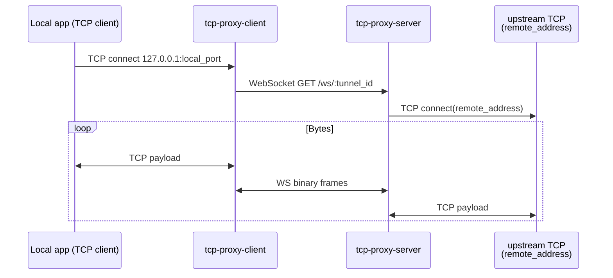

# pspxy

**Language:** English | **[中文自述](README.zh-CN.md)**

A TCP bridging system over **WebSocket**: run a **[server](cmd/server)** (API + ingress + relay) with an embedded **[admin SPA](frontend/web-admin)**, plus a **[client](cmd/client)** that can operate in **CLI / Web UI**, map **local TCP** to configurable upstream addresses, or run **reverse tunnels** so peers reach your local services via a server-issued **`channel_id`**, using the same **`GET /ws/:tunnel_id`** ingress shape as TCP-registered proxies.

Binary builds and Alpine images are automated in CI; runtime images pull **Aliyun CDN mirrors** for `apk` repositories.

---

## Features

| Area | Description |
|------|--------------|
| **Forward tunnel** | Client listens on `127.0.0.1:<local_port>`; each TCP uses `GET /ws/:tunnel_id` where **`tunnel_id` is the admin-registered proxy id**; the server dials **`remote_address`**. |
| **Reverse tunnel** | **Port provider · outbound**: `GET /ws/rtunnel/provider`, server returns **`channel_id`**. **Consumer** (same ingress semantics): each local inbound TCP connects with **`GET /ws/:tunnel_id`** where **`tunnel_id = channel_id`**. Legacy `GET /ws/rtunnel/session/:channel_id` still works (reverse-only, no TCP-proxy lookup). |
| **Admin UI** | React SPA embedded in server (proxy CRUD, health, YAML-backed config reload). |
| **Client UI** | React SPA embedded in client (multiple tunnels, YAML `proxies`, optional AK/SK in browser `sessionStorage`). |
| **Auth** | Optional server **AK/SK** signatures (REST + WS; query fallback for browsers). |

---

## Download binaries (GitHub Releases)

CI publishes assets when you push a **git tag** (`ref_type == tag`):

| Asset | Purpose |
|--------|---------|
| `tcp-proxy-server-linux-amd64` | Server CLI (embedded admin SPA), Linux x86_64 |
| `tcp-proxy-client-windows-amd64.exe` | Client (embedded client SPA), Windows x86_64 |
| `tcp-proxy-client-linux-amd64` | Client (embedded client SPA), Linux x86_64 |

Portal: **[https://github.com/jiapeng1004/pspxy/releases](https://github.com/jiapeng1004/pspxy/releases)**

> Replace **`jiapeng1004`** with your fork org/user if applicable.

Requirements: runnable binary + **`config.yaml`** next to server; client may use **`config-client.yaml`** / Web UI for persistence.

---

## Docker images — Aliyun Container Registry (Hangzhou)

Log in:

```bash
docker login registry.cn-hangzhou.aliyuncs.com
```

| Image | Typical use |
|--------|--------------|
| `registry.cn-hangzhou.aliyuncs.com/jp-java/pspxy` | **Server**, port **3000** (`config.yaml` in image/context) |
| `registry.cn-hangzhou.aliyuncs.com/jp-java/pspxy-client` | **Client** Web UI **9420** (`Dockerfile.client` bundle) |

Pull examples:

```bash
docker pull registry.cn-hangzhou.aliyuncs.com/jp-java/pspxy:latest
docker pull registry.cn-hangzhou.aliyuncs.com/jp-java/pspxy-client:latest
```

Tagged releases also mirror the **git tag** when released (see workflow `docker/metadata-action`).

Run server (mount your own `config.yaml` as needed):

```bash
docker run --rm -p 3000:3000 \
  -v /path/to/config.yaml:/app/config.yaml:ro \
  registry.cn-hangzhou.aliyuncs.com/jp-java/pspxy:latest
```

Run client UI:

```bash
docker run --rm -p 9420:9420 \
  -v pspxy-client-data:/app \
  registry.cn-hangzhou.aliyuncs.com/jp-java/pspxy-client:latest
```

More detail: **`DOCKER-SERVER.md`**, **`DOCKER-CLIENT.md`**.

---

## Repository layout

```text
.
├── cmd/
│   ├── server/           # Gin API + WebSocket tunnels + embedded admin SPA
│   └── client/           # Headless tunnel / embedded client Web UI
├── frontend/
│   ├── web-admin/        # Manage proxies (embedded in server)
│   └── web-client/       # Tunnel manager (embedded in client)
├── internal/
│   ├── api/              # HTTP handlers (REST, WS ingress, reverse tunnel endpoints)
│   ├── proxy/            # Registered proxies, WS⇄TCP bridging (forward path)
│   ├── reversetunnel/    # Channel broker (reverse path multiplexing)
│   ├── clienttunnel/    # Registry, dial paths, reverse provider/consumer
│   ├── clientui/        # Serve client SPA + control API
│   ├── config/           # Server YAML (`config.yaml`)
│   ├── clientconfig/     # Client YAML (`config-client.yaml`)
│   └── embed/            # go:embed static bundles (admin/dist, client/dist)
├── Dockerfile             # Thin server runtime (Alpine + prebuilt binary)
├── Dockerfile.client      # Thin client runtime
├── DOCKER-SERVER.md
├── DOCKER-CLIENT.md
└── .github/workflows/ci.yml
```

---

## Sequence diagrams

### Forward tunnel (classic)



### Reverse tunnel (expose local TCP)

```mermaid
sequenceDiagram
    participant PV as Reverse provider CLI
    participant LOC as Local TCP (behind PV)
    participant SRV as Broker (server)
    participant CS as Reverse consumer CLI
    participant LHS as Peer app @ consumer

    PV->>SRV: WS /ws/rtunnel/provider (+ offer JSON)
    SRV-->>PV: channel_id (uuid)
    CS->>SRV: WS GET /ws/:channel_id (per inbound TCP; legacy `/ws/rtunnel/session/:channel_id`)
    SRV->>PV: TEXT attach sid
    PV->>PV: Dial local svc
    PV-->>SRV: TEXT attached OK
    loop Data path (symmetric reverse)
      LHS->>CS: TCP
      CS->>SRV: WebSocket frames
      SRV->>PV: multiplex WS
      PV->>LOC: TCP
      LOC->>PV: TCP reply
      PV->>SRV: WebSocket
      SRV->>CS: WebSocket reply
      CS->>LHS: TCP reply
    end
```

---

## Tech stack

| Layer | Choice |
|--------|--------|
| Language | Go **1.21** |
| Server HTTP | Gin |
| WebSocket | gorilla/websocket |
| Config | YAML (**gopkg.in/yaml.v3**); server hot reload (**fsnotify** where applicable) |
| IDs | google/uuid |
| Client / Admin UI | **React 18** + TypeScript + **Vite 5**, **Ant Design** |
| Embedding | **`go:embed`** under `internal/embed/{admin,client}/dist` |
| CI | GitHub Actions: npm caches, **`setup-go`** cache, **`docker/build-push-action`**, **`softprops/action-gh-release`** |
| Runtime image | Alpine; **apk** mirrors switched to **`mirrors.aliyun.com`** in Dockerfiles |

---

## Quick start (from source)

```bash
# Server: build admin → embed → go build (see DOCKER-SERVER.md for full flow)
cd frontend/web-admin && npm ci && npm run build
# sync dist → internal/embed/admin/dist (see docs)

go run ./cmd/server   # expects config.yaml in cwd

# Client Web UI dev (separate terminal)
cd frontend/web-client && npm ci && npm run dev
```

For scripted builds Monorepo-style: **`go run build.go`** (targets `server`, `web-admin`, etc.) — see `build.go` usage text.

Reverse tunnel CLI examples live in **`cmd/client`** (`-reverse-provider`, `-reverse-consumer`, `-reverse-channel-id`, …).

---

## License / contributing

(Add your license file and contribution guidelines here if desired.)
