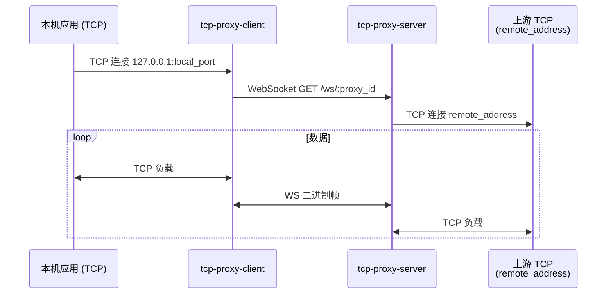

# pspxy

**语言：** [English README](README.md) | 中文

基于 **WebSocket** 的 **TCP 桥接**：**[服务端](cmd/server)**（API、入口与会话中继）内置 **[管理端 SPA](frontend/web-admin)**；**[客户端](cmd/client)** 支持 **命令行 / 内置 Web UI**，可将 **本地 TCP** 映射到服务端配置的远端地址，或使用 **反向隧道** 暴露本机服务，其他机器通过服务端下发的 **`channel_id`** 接入。

CI 自动构建二进制与精简 Alpine 镜像；Dockerfile 中 **Alpine apk 使用阿里云镜像源**。

---

## 功能概览

| 能力 | 说明 |
|------|------|
| **正向隧道** | 客户端在本机 `127.0.0.1:<端口>` 监听；每个 TCP 连接经 `GET /ws/:proxy_id` 连到服务端，服务端 **主动拨号** 管理端配置的 `remote_address`。 |
| **反向隧道** | **`/ws/rtunnel/provider`** 注册暴露端（首帧 JSON），服务端返回 **`channel_id`**（UUID）；接入端对每个本地入站 TCP 再起 **`/ws/rtunnel/session/:channel_id`**，经服务端 Broker **多路复用**转发到暴露端所连的本机 TCP。 |
| **管理界面** | 管理端 SPA 嵌入服务端镜像/二进制（代理 CRUD、健康检查、YAML 热重载等）。 |
| **客户端界面** | 客户端 SPA 嵌入二进制（多条隧道、`proxies` 持久化、可选 AK/SK 仅存 **`sessionStorage`**）。 |
| **鉴权** | 服务端可选 **AK/SK** 签名（REST + WebSocket；浏览器可用 Query 传参）。 |

---

## 二进制下载（传送门）

在推送 **git tag** 时，CI 将以下文件发布至 **GitHub Releases**：

| 文件 | 用途 |
|------|------|
| `tcp-proxy-server-linux-amd64` | 服务端（已内嵌管理端 SPA），Linux x86_64 |
| `tcp-proxy-client-windows-amd64.exe` | 客户端（已内嵌客户端 SPA），Windows x86_64 |
| `tcp-proxy-client-linux-amd64` | 客户端（已内嵌客户端 SPA），Linux x86_64 |

**[GitHub Releases](https://github.com/jiapeng1004/pspxy/releases)**

> 若为 fork，请将 **`jiapeng1004/pspxy`** 换成你的 **用户名/仓库名**。

服务端需 **`config.yaml`**；客户端可使用 **`config-client.yaml`** / Web UI 做多条隧道持久化。

---

## Docker 镜像 — 阿里云 ACR（传送门）

**登录：**

```bash
docker login registry.cn-hangzhou.aliyuncs.com
```

**拉取示例：**

```bash
docker pull registry.cn-hangzhou.aliyuncs.com/jp-java/pspxy:latest
docker pull registry.cn-hangzhou.aliyuncs.com/jp-java/pspxy-client:latest
```

| 镜像地址 | 说明 |
|-----------|------|
| `registry.cn-hangzhou.aliyuncs.com/jp-java/pspxy` | 服务端，监听 **3000**（镜像内含 `config.yaml`，生产建议挂载替换） |
| `registry.cn-hangzhou.aliyuncs.com/jp-java/pspxy-client` | 客户端，Web UI **9420** |

打 **git tag** 发布时流水线会额外打上与该 tag 一致的标签（参见 `docker/metadata-action`）。

**运行服务端示例：**

```bash
docker run --rm -p 3000:3000 \
  -v /你的路径/config.yaml:/app/config.yaml:ro \
  registry.cn-hangzhou.aliyuncs.com/jp-java/pspxy:latest
```

**运行客户端 Web UI：**

```bash
docker run --rm -p 9420:9420 \
  -v pspxy-client-data:/app \
  registry.cn-hangzhou.aliyuncs.com/jp-java/pspxy-client:latest
```

更多说明见 **`DOCKER-SERVER.md`**、**`DOCKER-CLIENT.md`**。

---

## 仓库结构（代码）

```text
.
├── cmd/
│   ├── server/           # Gin API + WebSocket 隧道 + 内嵌管理端 SPA
│   └── client/           # 无头隧道 / 内嵌客户端 Web UI
├── frontend/
│   ├── web-admin/        # 管理端（嵌入服务端）
│   └── web-client/       # 客户端（嵌入 client 二进制）
├── internal/
│   ├── api/              # REST / 正向 WS / 反向隧道入口
│   ├── proxy/            # 已登记代理、WS⇄TCP（正向）
│   ├── reversetunnel/    # 反向通道 Broker、多路复用
│   ├── clienttunnel/     # 多实例注册表、拨号、反向 provider/consumer
│   ├── clientui/         # 客户端 SPA + 控制 API
│   ├── config/           # 服务端 YAML（config.yaml）
│   ├── clientconfig/     # 客户端 YAML（config-client.yaml）
│   └── embed/            # go:embed 静态资源（admin/dist、client/dist）
├── Dockerfile            # 服务端运行时（Alpine + 预编译二进制）
├── Dockerfile.client     # 客户端运行时
├── DOCKER-SERVER.md
├── DOCKER-CLIENT.md
└── .github/workflows/ci.yml
```

---

## 时序图

### 正向隧道（经典）



### 反向隧道（暴露本机 TCP）

```mermaid
sequenceDiagram
    participant PV as 反向 provider CLI
    participant SRV as Broker（服务端）
    participant CS as 反向 consumer CLI
    participant LHS as consumer 侧应用

    PV->>SRV: WS /ws/rtunnel/provider（offer JSON）
    SRV-->>PV: channel_id (uuid)
    CS->>SRV: WS /ws/rtunnel/session/:channel_id<br/>（每个入站 TCP 一条）
    SRV->>PV: TEXT attach sid
    PV->>PV: Dial 本机服务
    PV-->>SRV: TEXT attached OK
    loop 多会话
      LHS<<->>CS<<->>SRV<<->>PV<<->>本机服务
    end
```

---

## 技术栈

| 层次 | 选型 |
|------|------|
| 语言 | Go **1.21** |
| 服务端 HTTP | Gin |
| WebSocket | gorilla/websocket |
| 配置 | YAML（**gopkg.in/yaml.v3**）；服务端热重载（**fsnotify** 等） |
| ID | google/uuid |
| 前端 | **React 18** + TypeScript + **Vite 5**，**Ant Design** |
| 静态嵌入 | **`go:embed`**（`internal/embed/{admin,client}/dist`） |
| CI | GitHub Actions：npm / Go 缓存、**Docker Buildx**、**GitHub Releases** 发布二进制 |
| 运行镜像 | Alpine；Dockerfile 内 **`mirrors.aliyun.com`** apk 源 |

---

## 从源码快速试跑

```bash
# 服务端：先编译管理端 SPA 并拷入 internal/embed/admin/dist（见 DOCKER-SERVER.md）
cd frontend/web-admin && npm ci && npm run build
# …同步 dist …

go run ./cmd/server   # 需在 cwd 有 config.yaml

# 客户端 Web 开发（另开终端）
cd frontend/web-client && npm ci && npm run dev
```

仓库内也可用 **`go run build.go`** 查看 `server`、`web-admin`、`clients` 等目标说明。

反向隧道命令行：**`cmd/client`**（`-reverse-provider`、`-reverse-consumer`、`-reverse-channel-id` 等）。

---

## 许可与贡献

（可在此补充 License 与贡献说明。）
