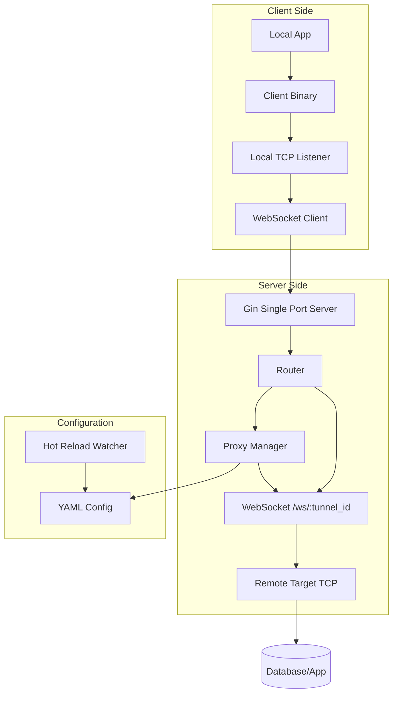

# Design: TCP Proxy System Architecture

## Overview

本设计文档描述 TCP 代理系统的整体架构、模块划分和数据流。

## Architecture Diagram



## Module Breakdown

### 1. Proxy Core (`internal/proxy`)

**职责**: TCP 连接管理、协议转换

**关键接口**:
```go
type Proxy interface {
    Start() error
    Stop() error
    Status() ProxyStatus
}

type ProxyManager interface {
    AddProxy(cfg ProxyConfig) error
    RemoveProxy(id string) error
    UpdateProxy(id string, cfg ProxyConfig) error
    GetAllProxies() []ProxyStatus
}
```

**实现细节**:
- **不再**按代理独占 `net.Listen` 服务端端口；入口统一在服务 `server.port` 的 HTTP 路由上，通过 `/ws/:id` 区分后端。
- WebSocket ↔ 远端 TCP 使用 goroutine `io.Copy` 双向转发

### 2. Configuration Manager (`internal/config`)

**职责**: YAML 配置读写、热重载

**关键结构**:
```go
type Config struct {
    Proxies []ProxyConfig `yaml:"proxies"`
    Server  ServerConfig  `yaml:"server"`
}

type ProxyConfig struct {
    ID            string `yaml:"id"`
    Name          string `yaml:"name"`
    RemoteAddress string `yaml:"remote_address"`
    Enabled       bool   `yaml:"enabled"`
}
```

**热重载机制**:
- 使用 `fsnotify` 监听文件变更
- 原子写入：先写临时文件再 rename
- 配置验证失败则回滚

### 3. API Handlers (`internal/api`)

**职责**: HTTP 路由、请求处理

**路由表**:
```
GET    /api/v1/proxies          -> ListProxies
POST   /api/v1/proxies          -> CreateProxy
GET    /api/v1/proxies/:id      -> GetProxy
PUT    /api/v1/proxies/:id      -> UpdateProxy
DELETE /api/v1/proxies/:id      -> DeleteProxy
POST   /api/v1/config/reload    -> ReloadConfig
GET    /api/v1/health           -> HealthCheck
WS     /ws/:tunnel_id         -> Tunnel ingress (TCP-proxy or reverse-consumer)
```

**依赖注入**:
```go
func NewHandler(proxyMgr ProxyManager, cfgMgr *config.Config) *Handler {
    return &Handler{
        proxyMgr: proxyMgr,
        cfgMgr:   cfgMgr,
    }
}
```

### 4. WebSocket Handler (`internal/proxy/ws_handler.go`)

**实现**:
```go
func (h *WSHandler) HandleUpgrade(w http.ResponseWriter, r *http.Request) {
    conn, err := upgrader.Upgrade(w, r, nil)
    if err != nil {
        return
    }
    defer conn.Close()
    
    tunnelID := chi.URLParam(r, "tunnel_id")
    targetConn, err := net.Dial("tcp", h.getTargetAddress(tunnelID))
    if err != nil {
        return
    }
    
    // 双向数据拷贝
    go io.Copy(conn.UnderlyingConn(), targetConn)
    io.Copy(targetConn, conn.UnderlyingConn())
}
```

## Data Flow

### WebSocket 隧道流程

```
Client App -> Local TCP:3306
    |
    v
Client Binary (WS Client)
    |
    v
WebSocket Connection (ws://server:3000/ws/proxy-xxx)
    |
    v
Server WS Handler
    |
    v
Proxy Manager (lookup target address)
    |
    v
Remote Database (db.example.com:3306)
```

### 配置更新流程

```
Web UI Form Submit
    |
    v
POST /api/v1/proxies
    |
    v
API Handler validates input
    |
    v
Config Manager updates YAML
    |
    v
Proxy Manager restarts affected proxies
    |
    v
Return success response
```

## Dependency Graph

```
cmd/server/main.go
    ├── internal/config (Config loading)
    ├── internal/proxy (ProxyManager)
    └── internal/api (HTTP handlers)
         └── internal/proxy (injected)
```

## Error Handling Strategy

1. **配置错误**: 记录日志，保留旧配置
2. **远端地址非法**: API/校验失败则拒绝写入配置
3. **连接失败**: 重试 3 次，标记代理为 "error" 状态
4. **运行时 panic**: recover 并记录堆栈

## Security Considerations

1. **认证**: 基础 Token 认证（可扩展 JWT）
2. **TLS**: 支持 HTTPS/WSS（可选配置）
3. **速率限制**: 每 IP 最大连接数限制
4. **日志脱敏**: 不记录完整的目标地址

## Performance Optimization

1. **连接池**: 复用后端连接（可选）
2. **缓冲池**: `sync.Pool` 管理 `[]byte`
3. **Goroutine 限制**: 最大并发连接数
4. **零拷贝**: 使用 `io.Copy` 而非手动缓冲
